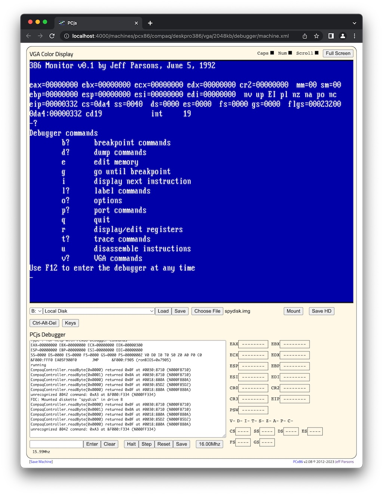

## SPY: A Custom v86-mode Debugger for the 80386

This is a resurrected version of a tool I wrote some 30 years ago to help debug issues with
DOS (or other real-mode x86 software), especially issues occurring during the boot process,
or issues that couldn't easily be debugged with a conventional debugger.  It used v86-mode to
to maintain more control over the machine and any real-mode software, while simultaneously
being less intrusive.

Since this tool was never meant to be an actual product, it makes lots of assumptions,
does the bare minimum required to get the job done, probably contains a number of mistakes
and bugs, and will no doubt crash in a variety of circumstances.

But, that said, I still think it's a cool and potentially still useful piece of software.

### Overview

Operation is simple: on an 80386 machine, from a real-mode DOS prompt, run SPY.  Think of SPY
like a glorified TSR, except that instead of terminating-and-staying resident somewhere within
the first 640K, SPY switches to protected mode, relocates itself above 1Mb, saves the contents
of the screen, switches to its built-in debugger, and then waits for you to give it a command.

The SPY debugger's '?' command will give you a list of other commands.  At this point, you
would normally just type 'g', which returns execution back to the real-mode portion of SPY --
except that *now* the machine is running in v86-mode instead of real-mode.

You can press the F12 key at any time to jump back into the SPY debugger, inspect memory,
set breakpoints, etc.  You can even inspect the original screen using the 'v' command; pressing
any other key to return to the debugger's screen.  I have no recollection of how "complete"
the debugger is, and I'm sure I will find more bugs to fix as I begin using it -- all I've done
so far is get it loaded and launched into v86-mode successfully.

SPY assumes your machine has at least 2Mb of RAM.  Well, actually, it doesn't really care how
much memory you have *below* the 1Mb line (which could be 640K or less), but it does assume you
have at least 320K or so above the 1Mb line; most of that memory is used saving/restoring the
entire VGA state whenever entering/exiting the SPY debugger.

### The Tools

When I originally archived this project, I also saved a set of [tools](tools/) that can
be used to rebuild SPY from scratch -- which was fortunate, because I'm not sure how easy it
would be find some of those tools today.

SPY is a bit unusual because it's a a COM file with a mixture of 16-bit and 32-bit code, and
the 32-bit code is a mixture of assembly and *C*.

The C compiler, **CL3232**, wasn't really designed for producing code in this environment.  One
of the challenges I ran into when trying to rebuild SPY was re-discovering that code and data
fixups were being made relative to their respective classes ('CODE' and 'DATA').  This wasn't
really a problem, as all the code assumed a small flat memory model where CS != DS anyway.

Well, almost all the code.  The C compiler didn't *appear* to make any assumptions about CS and
DS, with one exception: when generating code for *switch* statements, it would produce in-line
jump tables, and it would "JMP" through those tables *without* a CS override.  In other words,
there was an implicit assumption that CS == DS.

So, I wrote a crude little C program, [FIXASM](fixasm.c), that looks for those "JMP DWORD PTR"
instructions and inserts a "CS:" override.  This also meant changing the [MAKEFILE](makefile) to
have **CL3232** produce assembly files instead object files, running the assembly files through
[FIXASM](fixasm.c), and then assembling them with **ML**.  Problem solved.

There were a number of other minor problems, like some unexpected padding between code and
data sections, failure to preserve the initial interrupt mask registers (IMRs), and failure to
allocate memory for the VGA save/restore operations.  I call these problems "minor", but
they took a while to debug, even with this handy [PCjs Machine](http://www.pcjs.org/machines/pcx86/compaq/deskpro386/vga/2048kb/debugger/machine.xml).

The last issue made me wonder if there was a different version of the code somewhere, because
I know I had a working version of SPY at one point.  If I find a different or more complete
version of the source code later, I'll incorporate it into the repository.

### Trivia

In the [VxD](vxd/) folder, I included another variation of this tool that was designed to load as
a Windows 3.x/Windows 95 VxD.  I'm not sure how I found the time to work on these things while also
keeping up with all my Windows 95 and MS-DOS 6 development responsibilities.  Probably a lot of late nights.
